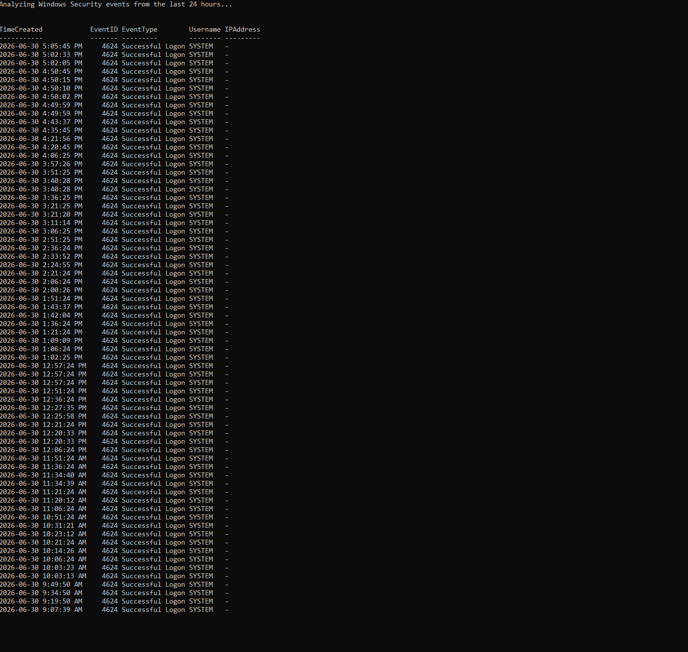

# Windows Event Log Analyzer

A PowerShell cybersecurity tool that analyzes Windows Security event logs and creates a CSV report.

## Features

- Detects successful logins using Event ID 4624
- Detects failed login attempts using Event ID 4625
- Detects account lockouts using Event ID 4740
- Displays usernames, IP addresses, workstations, and login types
- Warns when a high number of failed logins is detected
- Exports results to a CSV file

## Requirements

- Windows 10 or Windows 11
- PowerShell 5.1 or newer
- Administrator privileges

## How to Run

Open PowerShell as Administrator.

Navigate to the folder containing the script:

```powershell
cd "C:\path\to\windows-event-log-analyzer"
```

Run the script:

```powershell
.\event-log-analyzer.ps1
```

Analyze a different time period:

```powershell
.\event-log-analyzer.ps1 -HoursBack 48
```

Choose a custom output file:

```powershell
.\event-log-analyzer.ps1 -OutputPath ".\security-report.csv"
```

## Output

The script displays a summary in PowerShell and exports detailed results to:

```text
event-log-report.csv
```

## Windows Event IDs

| Event ID | Meaning |
|---|---|
| 4624 | Successful logon |
| 4625 | Failed logon |
| 4740 | Account locked out |

## Test Result

The analyzer was tested successfully against the local Windows Security event log.



## Disclaimer

This project is intended for educational and defensive cybersecurity purposes.
